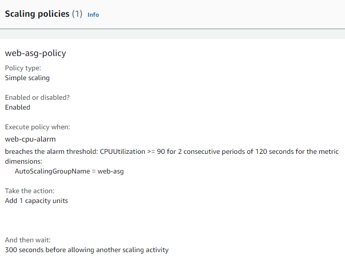

# AND-Technical-Test
Terraform a load balanced web front end in AWS

•	The solution should incorporate a number of elements

•	There should be a minimum of 2 instances and they need to be able to scale across availability zones.

•	Ideally the web page should be secure.

•	The VPC should be appropriately split into the required subnets.

•	The hosts should be running Linux and the choice of web server is down to you.

• The use of modules would be a good step but the focus should be on good terraform structure.

